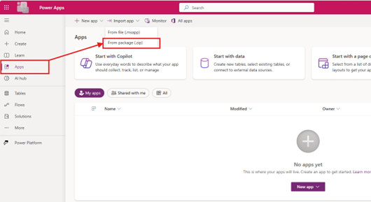
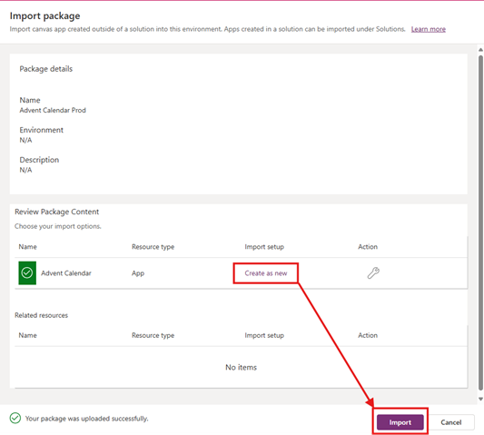
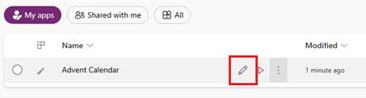
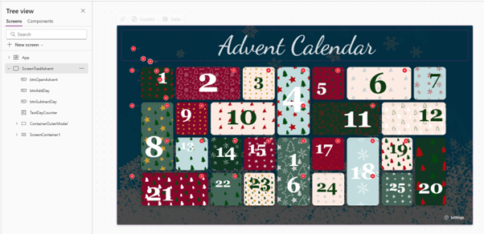

# Power-Apps-Advent-Calendar-Canvas-App
Beautiful Advent Calendar built using native Power Apps canvas controls

1️⃣ Import the Canvas App
1.	Download the **AdventCalender.zip** and the **Advent.xlsx** spreadsheet.
2.	Go to https://make.powerapps.com/ and click on **Apps** then click on **Import app > From package (.zip).**
 
3.	On the Import package screen change the setup to **Create as new** and click **Import**. 
  
4.	Wait a couple of minutes for the app to import into your environment.
5.	Click Edit the app.

6.  You’ll notice that there are a number of errors in the app. We’ll fix that in the next steps when we create our data source in SharePoint.

