# Power-Apps-Advent-Calendar-Canvas-App
Beautiful Advent Calendar built using native Power Apps canvas controls

##How to use the app
)

##Install the app 

1️⃣ Import the Canvas App
1.	Download the **AdventCalender.zip** and the **Advent.xlsx** spreadsheet.
   
2.	Go to https://make.powerapps.com/ and click on **Apps** then click on **Import app > From package (.zip).**
   
 
 
3.	On the Import package screen change the setup to **Create as new** and click **Import**.
   
  
  
4.	Wait a couple of minutes for the app to import into your environment.

5.	Click Edit the app.

6.  You’ll notice that there are a number of errors in the app. We’ll fix that in the next steps when we create our data source in SharePoint.
   

2️⃣ Prepare the SharePoint List

1.	Create a new list in a SharePoint site of your choice.
   
 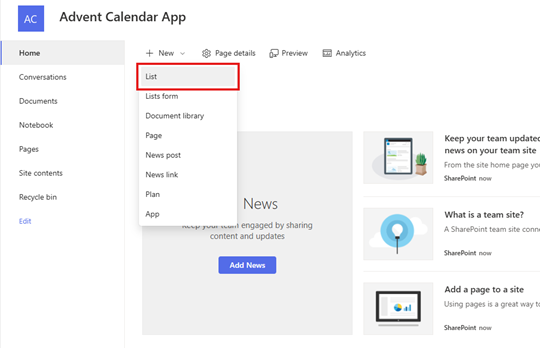
 
2.	Select Import From **Excel**
   
  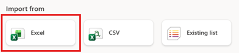

3.	Set the data types as follow:
•	Day: Number
•	Date: Date and time
•	Title: Title
•	Message: Multiple lines of text
•	Image: Do not import
•	Action: Choice
•	Action Description: Single line of text
•	Link: Single line of text
•	Attachment: Do not import
•	Email Subject: Single line of text
•	Email Message: Multiple lines of text

4.	Click Next and name the list **AdventCalendar* then click **Create.**
   
  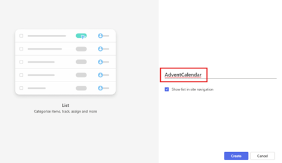
  
5.	Once the list is created, you’ll need to update some settings for the Date, Message, Action and Email Message columns.

6.	Go to List Settings

   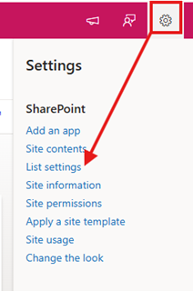

7.	On the List Settings screen, scroll down and select the **Date** column.

  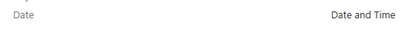
  
8.	Change the ‘Date and Time format’ to **Date Only** and click **OK.**
   
9.	Now select the **Message* column from the list. In the ‘Specify the type of text to allow:’ select **Enhanced rich text (Rich text with pictures, tables, and hyperlinks)** and click **OK.**

  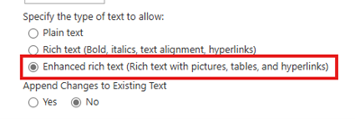

10.	Repeat step 9 for the **Email Message** column as we need to ensure that both of these columns can render Rich Text and HTML.
    
11.	Finally, select the Action column from the list.
    
12.	Add the following choice options:
•	Link
•	Email
•	Download

13.	Ensure that the **Default value** field is left blank.
    
14.	Click **OK**
    
  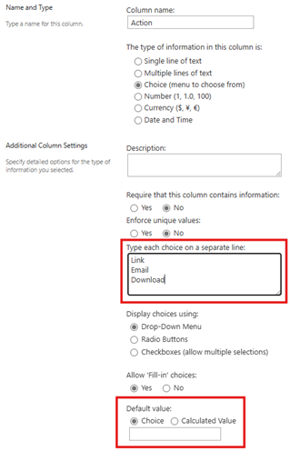
  
SharePoint setup is now complete. In the next steps, we will fix the data connections in the app.

3️⃣ Reconnect SharePoint and Outlook

1.	Open the Advent Calendar app
2.	Click on the Data icon and select Add data
 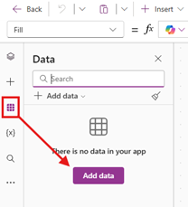
3.	Search for SharePoint and connect to your newly created list
   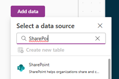        
  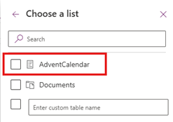
4.	All of the errors should resolve at this stage except for one. Let’s fix the final one.
  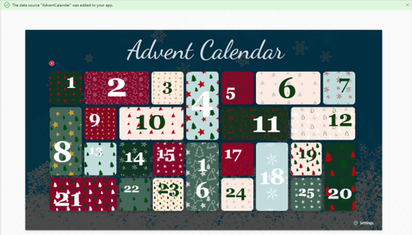
5.	Click on the data icon again and select Add Data
  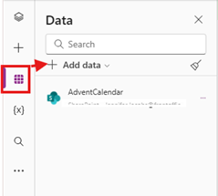
6.	Search for Outlook and select Office 365 Outlook. Connect to the data source.
  
That’s it! Setup is complete. If you’ve followed all the steps there shouldn’t be any more errors in the app. 

